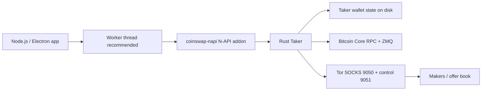
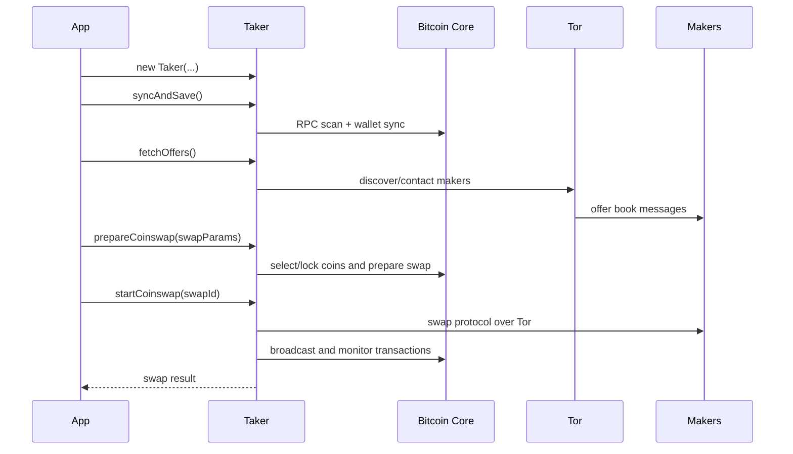

<div align="center">

# Coinswap JS

Node.js and TypeScript bindings for the Coinswap taker API.

[](./LICENSE)
[](https://nodejs.org)

</div>

> **Status:** beta software. Use Regtest or the project's Mutinynet/custom Signet setup for
> development.

## What This Package Provides

`coinswap-js` contains the JavaScript binding source. The package name in this directory is
`coinswap-napi`.

It exposes the Rust Coinswap **taker** API through a N-API native addon. The API is class-based:
create one `Taker` instance for one taker wallet, sync it with Bitcoin Core, inspect balances and
offers, then prepare and start swaps.

## Runtime Shape



Long-running methods are synchronous from JavaScript's perspective. UI apps should call taker
methods from a worker thread and serialize commands for a given `Taker` instance.

## Platform Support

Prebuilt targets are configured for:

| Platform | Architectures |
| --- | --- |
| Linux | x64, arm64, arm64 musl |
| macOS | x64, arm64 |
| Windows | x64, arm64 |
| FreeBSD | x64 |
| Android | arm64 |

## Install And Build

```bash
cd coinswap-js
yarn install
yarn build
```

For a debug build:

```bash
yarn build:debug
```

Local consumers can install the package from this directory:

```bash
npm install /path/to/coinswap-ffi/coinswap-js
```

Smoke test:

```js
const coinswap = require('coinswap-napi')

console.log(Object.keys(coinswap))
// Expected: Taker, AddressType, TakerBehavior, TakerError, ...
```

## Required Services

Bitcoin Core must expose RPC and ZMQ, and should be fully synced, non-pruned, and configured with
`txindex=1`. The local project scripts also enable `rest=1` and `blockfilterindex=1`; keep those
enabled for app integrations.

Tor must expose:

| Service | Default |
| --- | --- |
| SOCKS proxy | `127.0.0.1:9050` |
| Control port | `127.0.0.1:9051` |

The JS constructor accepts the Tor control port and password. The binding initialization path uses
SOCKS port `9050`.

### Regtest bitcoin.conf

This mirrors `ffi-commons/ffi-docker-setup`:

```ini
regtest=1
server=1
rest=1
txindex=1
blockfilterindex=1
fallbackfee=0.00001000

rpcuser=user
rpcpassword=password
rpcbind=127.0.0.1
rpcallowip=127.0.0.1
rpcport=18442

zmqpubrawblock=tcp://127.0.0.1:28332
zmqpubrawtx=tcp://127.0.0.1:28332
```

Matching JS values:

```ts
const rpcConfig = {
  url: 'http://127.0.0.1:18442',
  username: 'user',
  password: 'password',
  walletName: 'taker_wallet',
}

const zmqAddr = 'tcp://127.0.0.1:28332'
```

### Mutinynet / Custom Signet

Plain `signet=1` is not always enough for the project's Mutinynet/custom Signet environment. The
local `ffi-commons/signet-docker-script` passes custom values for `signetchallenge`, `addnode`,
`dnsseed`, and `signetblocktime`, plus RPC, ZMQ, `rest=1`, `txindex=1`, and
`blockfilterindex=1`.

Use the project script/image when possible. If configuring Bitcoin Core manually, include the
custom Signet values for the environment you are targeting:

```ini
signet=1
server=1
rest=1
txindex=1
blockfilterindex=1

rpcuser=user
rpcpassword=password
rpcbind=127.0.0.1
rpcallowip=127.0.0.1
rpcport=38332

# Required for the project's custom Signet/Mutinynet deployment:
# signetchallenge=...
# addnode=...
# dnsseed=...
# signetblocktime=...

zmqpubrawblock=tcp://127.0.0.1:28332
zmqpubrawtx=tcp://127.0.0.1:28332
```

## Basic Usage

```ts
import { AddressType, Taker, type RpcConfig, type SwapParams } from 'coinswap-napi'

const rpcConfig: RpcConfig = {
  url: 'http://127.0.0.1:18442',
  username: 'user',
  password: 'password',
  walletName: 'taker_wallet',
}

Taker.setupLogging(null, 'info')

const taker = new Taker(
  null,                         // dataDir; null uses backend default
  'taker_wallet',               // taker wallet file name
  rpcConfig,                    // Bitcoin Core RPC config
  9051,                         // Tor control port
  'coinswap',                   // Tor control password
  'tcp://127.0.0.1:28332',      // Bitcoin Core ZMQ endpoint
  '',                           // optional wallet encryption password
)

taker.syncAndSave()

const balances = taker.getBalances()
const receiveAddress = taker.getNextExternalAddress(AddressType.P2WPKH)

console.log(`spendable: ${balances.spendable} sats`)
console.log(`receive to: ${receiveAddress.address}`)

const offerBook = taker.fetchOffers()
const goodMakers = offerBook.makers.filter((candidate) => {
  return candidate.state.stateType === 'Good' && candidate.offer
})

if (goodMakers.length < 2) {
  throw new Error(`Need at least 2 good makers; found ${goodMakers.length}`)
}

const swapParams: SwapParams = {
  protocol: 'legacy',           // optional: legacy or taproot
  sendAmount: 100_000,          // sats
  makerCount: 2,                // maker hops
  txCount: 1,                   // optional; defaults to 1 in Rust
  requiredConfirms: 1,          // optional; defaults to 1 in Rust
}

const swapId = taker.prepareCoinswap(swapParams)
const report = taker.startCoinswap(swapId)

console.log(`swap id: ${report.swapId}`)
console.log(`status: ${report.status}`)
console.log(`fee paid or earned: ${report.feePaidOrEarned}`)
```

## Swap Flow



## API Reference

This section is code-shaped so agents can map directly from a task to the binding. For exact
generated types, read `index.d.ts`.

### Successful Swap Path

These calls are the minimum path most apps need for a standard taker swap:

```ts
// 1. Configure Bitcoin Core RPC. The URL must include http:// or https://.
const rpcConfig: RpcConfig = {
  url: 'http://127.0.0.1:18442',
  username: 'user',
  password: 'password',
  walletName: 'taker_wallet',
}

// 2. Configure logging before creating or using the taker.
Taker.setupLogging(null, 'info')

// 3. Create or load exactly one taker instance for this wallet.
const taker = new Taker(
  null,                         // dataDir: null uses the backend default directory
  'taker_wallet',               // walletFileName: taker wallet file to create or load
  rpcConfig,                    // rpcConfig: Bitcoin Core RPC settings
  9051,                         // controlPort: Tor control port
  'coinswap',                   // torAuthPassword: Tor control password
  'tcp://127.0.0.1:28332',      // zmqAddr: Bitcoin Core ZMQ endpoint
  '',                           // password: optional wallet encryption password
)

// 4. Sync wallet state before reading balances or selecting coins.
taker.syncAndSave()

// 5. Check funds and receive address if the app needs to fund the taker wallet.
const balances = taker.getBalances()
const receiveAddress = taker.getNextExternalAddress(AddressType.P2WPKH)

// 6. Fetch makers and ensure enough good candidates exist for the requested route.
const offerBook = taker.fetchOffers()
const goodMakers = offerBook.makers.filter((candidate) => {
  return candidate.state.stateType === 'Good' && candidate.offer
})

if (goodMakers.length < 2) {
  throw new Error(`Need at least 2 good makers; found ${goodMakers.length}`)
}

// 7. Prepare the swap first. This returns the swap id used by startCoinswap().
const swapId = taker.prepareCoinswap({
  protocol: 'legacy',
  sendAmount: 100_000,
  makerCount: 2,
  txCount: 1,
  requiredConfirms: 1,
})

// 8. Start the prepared swap. This blocks until success, failure, or recovery state.
const report = taker.startCoinswap(swapId)

// 9. Sync again before showing final balances.
taker.syncAndSave()
```

`startCoinswap()` returns a report object for display and diagnostics. Use `index.d.ts` for the
exact report shape when a UI needs detailed analytics.

### Constructor Inputs

```ts
type RpcConfig = {
  // Bitcoin Core RPC URL. Include the scheme and port.
  url: string

  // Bitcoin Core RPC username from bitcoin.conf.
  username: string

  // Bitcoin Core RPC password from bitcoin.conf.
  password: string

  // Bitcoin Core wallet name used by the taker backend.
  walletName: string
}
```

```ts
const taker = new Taker(
  dataDir,          // string | null | undefined; null uses backend default
  walletFileName,   // string | null | undefined; taker wallet file name
  rpcConfig,        // RpcConfig | null | undefined; Bitcoin Core RPC settings
  controlPort,      // number | null | undefined; usually 9051
  torAuthPassword,  // string | null | undefined; Tor control password
  zmqAddr,          // string; Bitcoin Core ZMQ endpoint, e.g. tcp://127.0.0.1:28332
  password,         // string | null | undefined; optional wallet encryption password
)
```

### Swap Inputs

```ts
type SwapParams = {
  // Optional protocol selector. Accepted values are legacy/Legacy or taproot/Taproot.
  protocol?: string

  // Satoshis to send through the swap.
  sendAmount: number

  // Number of maker hops to use.
  makerCount: number

  // Optional funding transaction split count. Rust defaults to 1.
  txCount?: number

  // Optional minimum confirmations required for funding inputs. Rust defaults to 1.
  requiredConfirms?: number

  // Optional explicit UTXOs to spend.
  manuallySelectedOutpoints?: { txid: string; vout: number }[]

  // Optional maker addresses to prefer.
  preferredMakers?: string[]
}
```

### Static Helpers

```ts
// Configure file logging for taker operations. Use before long-running calls.
Taker.setupLogging(dataDir, 'info')

// Route Rust logs/panic hook to the JavaScript console where supported.
Taker.initNativeLogging()

// Fetch fastest/standard/economy fee rates from mempool.space, with Esplora fallback.
const feeRates = Taker.fetchMempoolFees()

// Check whether a wallet file is encrypted.
const encrypted = Taker.isWalletEncrypted(walletPath)

// Restore a wallet backup for GUI app flows.
Taker.restoreWalletGuiApp(dataDir, walletFileName, rpcConfig, backupFile, password)
```

### Wallet Sync And Inspection

```ts
// Sync wallet state with Bitcoin Core and save wallet state to disk.
taker.syncAndSave()

// Read wallet balances in sats: regular, swap, contract, fidelity, spendable.
const balances = taker.getBalances()

// Read recent wallet transactions. count and skip are optional pagination arguments.
const transactions = taker.getTransactions(count, skip)

// Read the wallet name.
const walletName = taker.getName()

// Return all wallet UTXOs paired with spend metadata.
const utxos = taker.listAllUtxoSpendInfo()

// Lock UTXOs that should not be spent directly, such as live-contract or fidelity coins.
taker.lockUnspendableUtxos()

// Write a wallet backup to a destination path. Password is optional.
taker.backup(destinationPath, password)
```

### Addresses And Sending

```ts
// Derive one external receive address. AddressType.P2WPKH and AddressType.P2TR are exposed.
const receiveAddress = taker.getNextExternalAddress(AddressType.P2WPKH)

// Derive internal/change addresses.
const changeAddresses = taker.getNextInternalAddresses(5, AddressType.P2WPKH)

// Send sats to an external Bitcoin address. feeRate and selected outpoints are optional.
const txid = taker.sendToAddress(
  address,
  amountSats,
  feeRate,
  [{ txid: '...', vout: 0 }],
)
```

### Offers And Makers

```ts
// Block until the offer book is synchronized.
taker.syncOfferbookAndWait()

// Fetch the current offer book.
const offerBook = taker.fetchOffers()

// Fetch maker addresses across known states.
const makers = taker.fetchAllMakers()

// Render one offer as JSON-ish text for logs or debug UI.
const firstOffer = offerBook.makers.find((candidate) => candidate.offer)?.offer
const rendered = firstOffer ? taker.displayOffer(firstOffer) : null
```

Each maker candidate can include an `offer` with `minSize`, `maxSize`, `baseFee`,
`amountRelativeFeePct`, `timeRelativeFeePct`, `requiredConfirms`, `minimumLocktime`,
`tweakablePoint`, and `fidelity`.

### Swap And Recovery

```ts
// Prepare a swap and receive a swap id.
const swapId = taker.prepareCoinswap(swapParams)

// Start a prepared swap and receive the final report object.
const report = taker.startCoinswap(swapId)

// Attempt recovery for an active failed swap.
taker.recoverActiveSwap()
```

### Return Shapes Used Most Often

```ts
type Balances = {
  regular: number
  swap: number
  contract: number
  fidelity: number
  spendable: number
}

type Address = {
  address: string
}

type Txid = {
  value: string
}

type OfferBook = {
  makers: MakerOfferCandidate[]
}
```

## Worker Pattern For Apps

Keep one `Taker` inside one worker and expose app-level commands such as `INIT`, `SYNC`,
`FETCH_OFFERS`, `SWAP`, and `SEND`. This avoids freezing Electron's main process and keeps wallet
state serialized.

```js
// coinswap-worker.js
'use strict'

const { parentPort } = require('worker_threads')
const { AddressType, Taker } = require('coinswap-napi')

let taker = null

parentPort.on('message', (msg) => {
  try {
    if (msg.type === 'INIT') {
      const cfg = msg.config
      Taker.setupLogging(cfg.dataDir ?? null, cfg.logLevel ?? 'info')
      taker = new Taker(
        cfg.dataDir ?? null,
        cfg.walletFileName,
        cfg.rpcConfig,
        cfg.controlPort ?? 9051,
        cfg.torAuthPassword ?? null,
        cfg.zmqAddr,
        cfg.password ?? '',
      )
      parentPort.postMessage({ type: 'INIT_OK' })
      return
    }

    if (!taker) throw new Error('Taker is not initialized')

    if (msg.type === 'SYNC') {
      taker.syncAndSave()
      parentPort.postMessage({ type: 'SYNC_OK', balances: taker.getBalances() })
    } else if (msg.type === 'GET_ADDRESS') {
      parentPort.postMessage({
        type: 'ADDRESS_OK',
        address: taker.getNextExternalAddress(AddressType.P2WPKH),
      })
    } else if (msg.type === 'FETCH_OFFERS') {
      parentPort.postMessage({ type: 'OFFERS_OK', offerBook: taker.fetchOffers() })
    } else if (msg.type === 'SWAP') {
      const swapId = taker.prepareCoinswap(msg.swapParams)
      const report = taker.startCoinswap(swapId)
      parentPort.postMessage({ type: 'SWAP_OK', swapId, report })
    } else if (msg.type === 'SEND') {
      const txid = taker.sendToAddress(
        msg.address,
        msg.amount,
        msg.feeRate ?? undefined,
        msg.manuallySelectedOutpoints ?? undefined,
      )
      parentPort.postMessage({ type: 'SEND_OK', txid })
    }
  } catch (err) {
    parentPort.postMessage({
      type: 'ERR',
      cause: msg.type,
      error: err instanceof Error ? err.message : String(err),
    })
  }
})
```

## Error Handling

N-API methods either return normally or throw a JavaScript `Error`. The binding maps many Rust
errors with `napi::Error::from_reason(...)`, so `error.message` is the useful value.

Agent-friendly recovery rules:

- RPC error: check `rpcConfig.url`, credentials, wallet name, sync status, and `bitcoin.conf`.
- Tor error: check Tor process, control port/password, and SOCKS `127.0.0.1:9050`.
- Offer error: call `fetchOffers()` again and inspect `offerBook.makers`.
- Balance error: call `syncAndSave()`, then `getBalances()`.
- Failed swap: do not assume funds are lost; sync, inspect balances, and call
  `recoverActiveSwap()` when appropriate.

## Integration Checklist

- [ ] Import from the installed package name, currently `coinswap-napi` for this directory.
- [ ] Run Node.js 18 or newer.
- [ ] Install Rust 1.75.0 or newer when building from source.
- [ ] Build with `yarn install` and `yarn build`.
- [ ] Run Bitcoin Core with RPC, ZMQ, `rest=1`, `txindex=1`, and `blockfilterindex=1`.
- [ ] Use an `rpcConfig.url` with a scheme, for example `http://127.0.0.1:18442`.
- [ ] Set `rpcConfig.walletName` to the Bitcoin Core wallet name used by the taker.
- [ ] Pass a `zmqAddr` matching Bitcoin Core's ZMQ endpoint.
- [ ] Run Tor with SOCKS `9050` and the configured control port/password.
- [ ] Use one `Taker` instance per wallet.
- [ ] Serialize calls for that `Taker`.
- [ ] Read makers from `fetchOffers().makers`.
- [ ] Use `prepareCoinswap()` followed by `startCoinswap()`.
- [ ] Use a worker thread for desktop/UI apps.

## References

- Reference Electron app: [citadel-tech/taker-app](https://github.com/citadel-tech/taker-app)
- FFI repository: [citadel-tech/coinswap-ffi](https://github.com/citadel-tech/coinswap-ffi)
- Rust core: [citadel-tech/coinswap](https://github.com/citadel-tech/coinswap)
- Protocol specification: [Coinswap-Protocol-Specification](https://github.com/citadel-tech/Coinswap-Protocol-Specification)

Local source files useful for integration:

- `index.d.ts` for the generated TypeScript surface.
- `src/taker.rs` for N-API method implementations.
- `src/types.rs` for exported object shapes.
- `../ffi-commons/ffi-docker-setup` for Regtest service flags.
- `../ffi-commons/signet-docker-script` for custom Signet/Mutinynet service flags.

## Support

- GitHub Issues: [coinswap-ffi/issues](https://github.com/citadel-tech/coinswap-ffi/issues)
- Discussions: [citadel-tech/coinswap](https://github.com/citadel-tech/coinswap/discussions)
